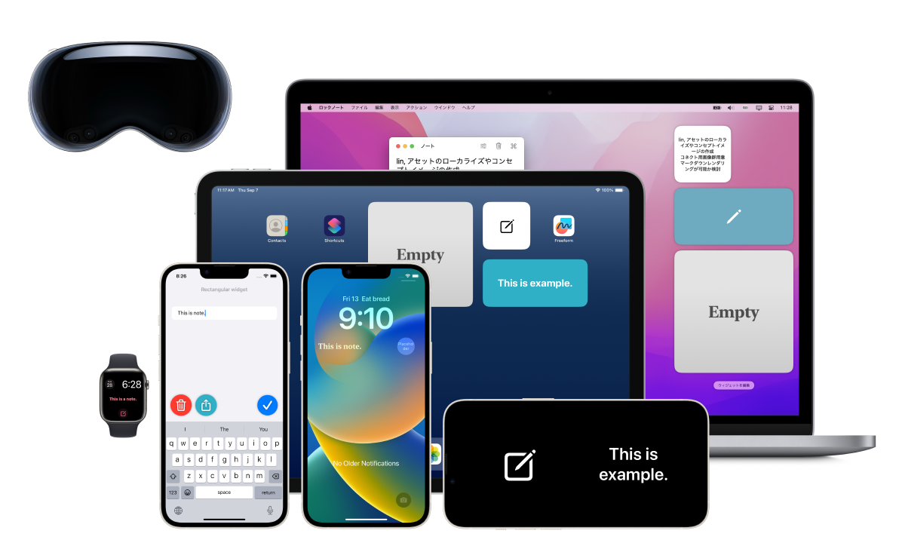

LockInNote - iPhone, iPad, Mac, Apple Watch
-------------------------------------------

Description
-------------
Memo note app specialized for widgets.

When you want to take a memo, you can write it out right away on the widgets, and you can easily check the memo on the widgets anytime!

The design of the memo note on the widgets can be flexibly customized, so it can be used for various purposes.

- Tap the widget to immediately edit the memo note.

- Font "size", "design", "color", and "weight" can be adjusted.

- You can also select the alignment of multiple lines, the display pattern when no text is entered, and more.

- Sync notes between devices by iCloud

- You can set any "URL scheme action" to link with other apps.(iOS, iPadOS, macOS)

- Share sheets allow you to easily share text to other applications.(iOS, iPadOS)

Multi platform support

iPhone: Home screen, Lock screen, StandBy(iOS 17)

iPad: Home screen, Lock screen(iPadOS 17)

Mac: Notification center, Desktop(macOS 14)

Apple Watch: Complication, Smart Stack(watchOS 10)

Source code link
-------------------
https://github.com/FlipByBlink/LockInNote

### Source code (Mirror) link
https://gitlab.com/FlipByBlink/LockInNote_Mirror

Contact
---------
sear_pandora_0x@icloud.com

AppStore link
--------------
https://apps.apple.com/app/id1644879340

 
 

* * *

 
 
 
 

Privacy Policy for AppStore
----------------------------
2022-09-12

English

This application don't collect user infomation.

(日本語)Japanese

このアプリ自身において、ユーザーの情報を一切収集しません。

 
 
 
 

* * *

 
 

<!-- URL "Support page for AppStore" -->
<!-- https://flipbyblink.github.io/LockInNote/ -->
<!-- URL "Privacy Policy for AppStore" -->
<!-- https://flipbyblink.github.io/LockInNote/#privacy-policy-for-appstore -->
